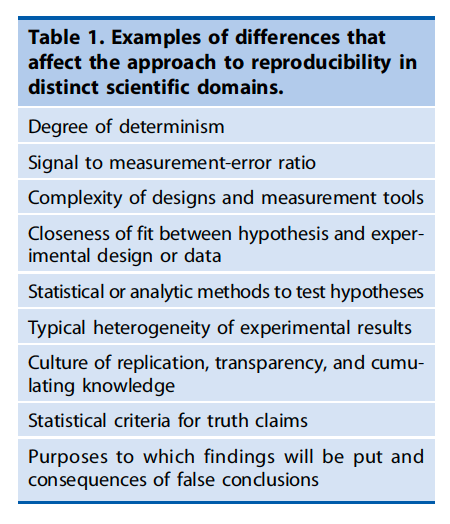

# The 5 R's  {-}

## Roadmap {-}

- The 4 (5?) R's
    - [@Nosek2022-hv](https://doi.org/10.1146/annurev-psych-020821-114157)
    - [@goodman_what_2016](https://doi.org/10.1126/scitranslmed.aaf5027)
    - Skim
        - [@Fidler2021-xn](https://plato.stanford.edu/archives/sum2021/entries/scientific-reproducibility/)

## Papers {-}

Nosek, B. A., Hardwicke, T. E., Moshontz, H., Allard, A., Corker, K. S., Dreber, A., Fidler, F., Hilgard, J., Kline Struhl, M., Nuijten, M. B., Rohrer, J. M., Romero, F., Scheel, A. M., Scherer, L. D., Schönbrodt, F. D. & Vazire, S. (2022). Replicability, robustness, and reproducibility in psychological science. *Annual Review of Psychology*, *73*(2022), 719–748. https://doi.org/10.1146/annurev-psych-020821-114157

Goodman, S. N., Fanelli, D. & Ioannidis, J. P. A. (2016). What does research reproducibility mean? *Science Translational Medicine*, *8*(341), 341ps12–ps341ps12. https://doi.org/10.1126/scitranslmed.aaf5027

>"*The language and conceptual framework of 'research reproducibility' are nonstandard and unsettled across the sciences. In this Perspective, we review an array of explicit and implicit definitions of reproducibility and related terminology, and discuss how to avoid potential misunderstandings when these terms are used as a surrogate for 'truth'.*"
>
>-- [@goodman_what_2016](https://doi.org/10.1126/scitranslmed.aaf5027)

```{r, fig.cap="Figure 1: [@goodman_what_2016](https://doi.org/10.1126/scitranslmed.aaf5027)", out.width="80%"}
knitr::include_graphics("https://www-science-org.ezaccess.libraries.psu.edu/cms/10.1126/scitranslmed.aaf5027/asset/25938b8b-3bdd-4557-b140-6db49d58b89a/assets/graphic/8-341ps12-f1.jpeg")
```

```{r, fig.cap="Table 1 from [@goodman_what_2016](https://doi.org/10.1126/scitranslmed.aaf5027)", out.width="80%"}

```

### Reproducibility {-}

>"*Although the importance of multiple studies corroborating a given result is acknowledged in virtually all of the sciences (Fig. 1), the modern use of “reproducible research” was originally applied not to corroboration, but to transparency, with application in the computational sciences. Computer scientist Jon Claerbout coined the term and associated it with a software platform and set of procedures that permit the reader of a paper to see the entire processing trail from the raw data and code to figures and tables (4).*"
>
>-- [@goodman_what_2016](https://doi.org/10.1126/scitranslmed.aaf5027)

---

>"*According to a U.S. National Science Foundation (NSF) subcommittee on replicability in science (9), 'reproducibility refers to the ability of a researcher to duplicate the results of a prior study using the same materials as were used by the original investigator. That is, a second researcher might use the same raw data to build the same analysis files and implement the same statistical analysis in an attempt to yield the same results…. Reproducibility is a minimum necessary condition for a finding to be believable and informative.'*"
>
>-- [@goodman_what_2016](https://doi.org/10.1126/scitranslmed.aaf5027)

---

> "...**Reproducibility** refers to testing the reliability of a prior finding using the same data and the same analysis strategy (Natl. Acad. Sci. Eng. Med. 2019)...In principle, all reported evidence should be reproducible. If someone applies the same analysis to the same data, the same result should occur..."
>
> -- [@Nosek2022-hv](https://doi.org/10.1146/annurev-psych-020821-114157)

#### *Methods* reproducibility {-}

- [@goodman_what_2016](http://doi.org/10.1126/scitranslmed.aaf5027)
- Enough details about materials & methods recorded (& reported), so...
- Same results with same materials & methods
    - [@Artner2021-qg](http://dx.doi.org/10.1037/met0000365).

>"*In the biomedical sciences, this means, at minimum, a detailed study protocol, a description of measurement procedures, the data gathered, the data used for analysis with descriptive metadata, the analysis software and code, and the final analytical results. In laboratory science, how key reagents and biological materials were created or obtained can be critical. In theory, these requirements are clear, but in practice, the level of procedural detail needed to describe a study as “methodologically reproducible” does not have consensus.*"
>
>-- [@goodman_what_2016](https://doi.org/10.1126/scitranslmed.aaf5027)

#### What's your project's 'bus number'? {-}

<!-- Hit by a bus -->
```{r, out.width="80%"}
knitr::include_graphics("http://lh6.ggpht.com/_KVa1Tk_k1BU/TTjL-RSY_eI/AAAAAAAABtg/VQIfae1_wtQ/hit_thumb%5B3%5D.jpg?imgmax=800")
```

### Replicability {-}

#### *Results* reproducibility {-} 

- [@goodman_what_2016](http://doi.org/10.1126/scitranslmed.aaf5027)
- Same results from "*independent study whose procedures are as closely matched to the original experiment as possible.*"

#### *Inferential* reproducibility {-}

- [@goodman_what_2016](http://doi.org/10.1126/scitranslmed.aaf5027)
- Same inferences from one or more studies or reanalyses
- "*Inferential reproducibility is not identical to results reproducibility or to methods reproducibility, because scientists might draw the same conclusions from different sets of studies and data or could draw different conclusions from the same original data, sometimes even if they agree on the analytical results.*"

### Robustness {-}

> "*...**Robustness** refers to testing the reliability of a prior finding using the same data and a different analysis strategy...*"
>
>-- [@Nosek2022-hv](https://doi.org/10.1146/annurev-psych-020821-114157)

- "Many analysts": [@Botvinik-Nezer2020-wr; @Silberzahn2018-st]

---

### Two additional "R's" {-}

[Gennetian2022-us](https://doi.org/10.1146/annurev-devpsych-120920-042335)

```{r, out.width="80%", fig.cap="Table 1 from [Gennetian2022-us](https://doi.org/10.1146/annurev-devpsych-120920-042335)"}
knitr::include_graphics("include/img/gennetian-etal-2022-table-01.png")
```

## Next time {-}

- Fraud & misconduct
    - [@Ritchie2020-fm], Chapter 3.
    - [[@Bhattacharjee2013-rw]](https://www.nytimes.com/2013/04/28/magazine/diederik-stapels-audacious-academic-fraud.html)
    - (Skim) [[@Levelt2012-ap]](https://pure.mpg.de/rest/items/item_1569964/component/file_1569966/content)
    - (Skim) [[@Carpenter2012-ot]](https://www.science.org/content/article/harvard-psychology-researcher-committed-fraud-us-investigation-concludes)
