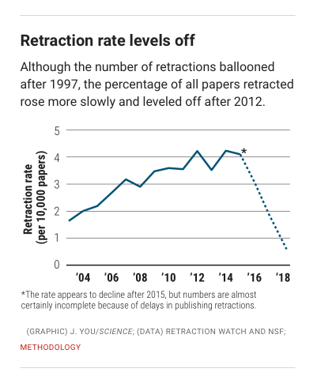

# Retraction and scientific integrity  {-}

## Roadmap {-}

- Retraction and scientific integrity
    - Read
        - [@Brainerd2018-iy](https://doi.org/10.1126/science.aav8384)
    - Explore
        - <https://retractionwatch.com/>
        - <https://ori.hhs.gov/>
- Discuss [assignment]{.green_assigned}
    - [Exercise 02: P-hack your way to scientific glory](#ex_p_hacking)
    - [Due next Tuesday, February 21, 2023]{.orange_due}.

## [@Brainerd2018-iy](https://doi.org/10.1126/science.aav8384)

- Study [methodology](https://www.science.org/content/article/about-these-data?adobe_mc=MCMID%3D47656180226673402683555563101738189823%7CMCORGID%3D242B6472541199F70A4C98A6%2540AdobeOrg%7CTS%3D1676298737&_ga=2.2514611.247686987.1676298736-1493408718.1676298736).

```{r, fig.cap="[@Brainerd2018-iy](https://doi.org/10.1126/science.aav8384)"}

```

> Then, in 2009, the Committee on Publication Ethics (COPE), a nonprofit group in Eastleigh, U.K., that now advises more than 12,000 journal editors and publishers, released [a model policy](https://publicationethics.org/files/retraction%20guidelines_0.pdf) for how journals should handle retractions.
>
>-- [@Brainerd2018-iy](https://doi.org/10.1126/science.aav8384)

- Link to policy is broken
- In searching on COPE page, I found this: <https://publicationethics.org/retraction-guidelines> and a DOI to this <https://doi.org/10.24318/cope.2019.1.4>

---

```{r, fig.cap="[@Brainerd2018-iy](https://doi.org/10.1126/science.aav8384)"}
knitr::include_graphics("include/img/brainerd-2018-fig-b.png")
```

```{r, fig.cap="[@Brainerd2018-iy](https://doi.org/10.1126/science.aav8384)"}
knitr::include_graphics("include/img/brainerd-2018-fig-c.png")
```

```{r, fig.cap="[@Brainerd2018-iy](https://doi.org/10.1126/science.aav8384)"}

```

```{r, fig.cap="[@Brainerd2018-iy](https://doi.org/10.1126/science.aav8384)"}
knitr::include_graphics("include/img/brainerd-2018-fig-e.png")
```

::: {.rmdnote}

PubPeer <https://pubpeer.com/static/faq> might make an interesting subject for a final project.

:::

>Behaviors widely understood within science to be dishonest and unethical, but which fall outside the U.S. misconduct definition, seem to account for another 10%. Those behaviors include forged authorship, fake peer reviews, and failure to obtain approval from institutional review boards for research on human subjects or animals. (Such retractions have increased as a share of all retractions, and some experts argue the United States should expand its definition of scientific misconduct to cover those behaviors.)
>
>-- [@Brainerd2018-iy](https://doi.org/10.1126/science.aav8384)

---

Fanelli, D., Costas, R. & Larivière, V. (2015). Misconduct Policies, Academic Culture and Career Stage, Not Gender or Pressures to Publish, Affect Scientific Integrity. *PloS One*, *10*(6), e0127556. https://doi.org/10.1371/journal.pone.0127556


