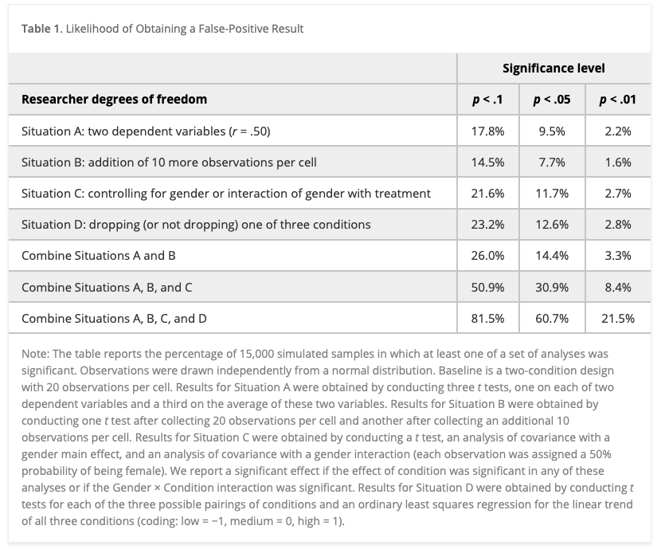
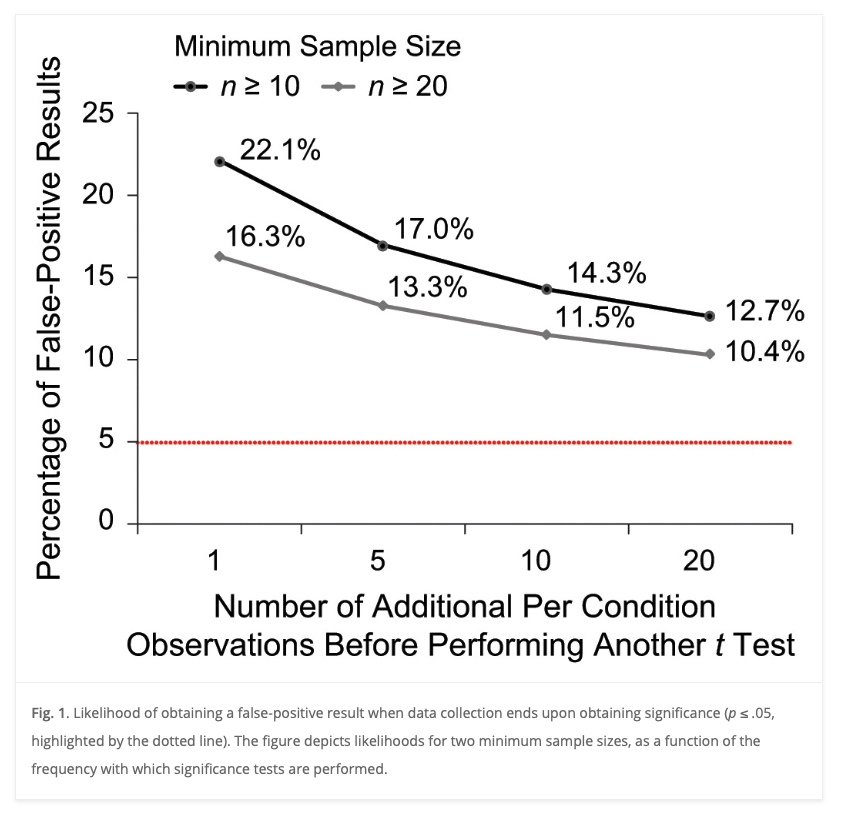
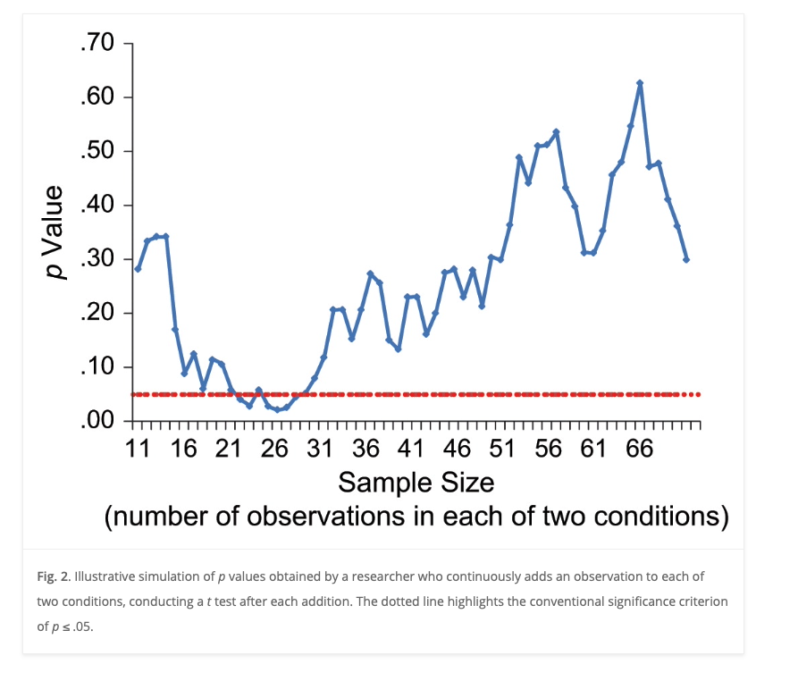
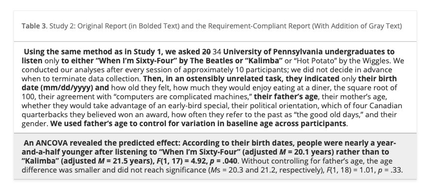
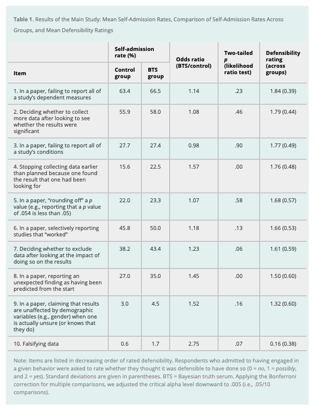

# Questionable research practices  {-}

## Roadmap {-}

- Read
  - [@simmons_false-positive_2011](http://dx.doi.org/10.1177/0956797611417632)
  - [@John2012-tk](http://dx.doi.org/10.1177/0956797611430953)
- Watch
  - [@Ngiam2020-ln](https://www.youtube.com/watch?v=bf3GqyBRgzY)
    
## Central questions {-}
    
- What are questionable research practices?

- Why should we care about them?

## Background {-}

### False positives vs. false negatives {-}

- Null hypothesis: There is no effect.

- Positive: What's actually true, a true fact
- Negative: What's actually not-true or false, a false fact
- What does our evidence say?

```{r, fig.cap="False positives vs. false negatives", out.width="80%", }
knitr::include_graphics("https://i.stack.imgur.com/Kq0OH.jpg")
```

| Evidence says | True fact | False fact |
|---------------|-----------|------------|
| True          | True positive | False positive (Type I) |
| False         | False negative (Type II) | True negative |

- Goals:
  - Minimize false positives (Type I errors)
  - Minimize false negatives (Type II errors)
- Practices
  - Set small *p*-value to reject null hypothesis if using null hypothesis significance testing (NHST)
  - Control alpha $\alpha$.
  - Control beta $\beta$ or statistical 'power' $1-\beta$.
    
### Researcher 'degrees of freedom' {-}

>The culprit is a construct we refer to as researcher degrees of freedom. In the course of collecting and analyzing data, researchers have many decisions to make: Should more data be collected? Should some observations be excluded? Which conditions should be combined and which ones compared? Which control variables should be considered? Should specific measures be combined or transformed or both?
>
>It is rare, and sometimes impractical, for researchers to make all these decisions beforehand. Rather, it is common (and accepted practice) for researchers to explore various analytic alternatives, to search for a combination that yields “statistical significance,” and to then report only what “worked.” The problem, of course, is that the likelihood of at least one (of many) analyses producing a falsely positive finding at the 5% level is necessarily greater than 5%.
>
>This exploratory behavior is not the by-product of malicious intent, but rather the result of two factors: (a) ambiguity in how best to make these decisions and (b) the researcher’s desire to find a statistically significant result.
>
>-- [@simmons_false-positive_2011](http://dx.doi.org/10.1177/0956797611417632)

- Choosing dependent measure or measures
- Choosing sample size
  - Stopping early
- Choosing covariates 
- Reporting subsets of conditions
  - Trimming data (e.g., how to treat outliers)
  
> In a perusal of roughly 30 Psychological Science articles, we discovered considerable inconsistency in, and hence considerable ambiguity about, this decision. Most (but not all) researchers excluded some responses for being too fast, but what constituted “too fast” varied enormously: the fastest 2.5%, or faster than 2 standard deviations from the mean, or faster than 100 or 150 or 200 or 300 ms. Similarly, what constituted “too slow” varied enormously: the slowest 2.5% or 10%, or 2 or 2.5 or 3 standard deviations slower than the mean, or 1.5 standard deviations slower from that condition’s mean, or slower than 1,000 or 1,200 or 1,500 or 2,000 or 3,000 or 5,000 ms. None of these decisions is necessarily incorrect, but that fact makes any of them justifiable and hence potential fodder for self-serving justifications.
>
>-- [@simmons_false-positive_2011](http://dx.doi.org/10.1177/0956797611417632)
  
```{r}
knitr::include_url("https://journals.sagepub.com/doi/10.1177/0956797611417632")
```

## [@simmons_false-positive_2011](http://dx.doi.org/10.1177/0956797611417632) {-}

### The studies {-}

<!-- Kalimba -->
<iframe width="560" height="315" src="https://www.youtube.com/embed/HCTunqv1Xt4" title="YouTube video player" frameborder="0" allow="accelerometer; autoplay; clipboard-write; encrypted-media; gyroscope; picture-in-picture; web-share" allowfullscreen></iframe>

<!-- Hot Potato -->
<iframe width="560" height="315" src="https://www.youtube.com/embed/0v4-eAefurY" title="YouTube video player" frameborder="0" allow="accelerometer; autoplay; clipboard-write; encrypted-media; gyroscope; picture-in-picture; web-share" allowfullscreen></iframe>

<!-- When I'm 64 -->
<iframe width="560" height="315" src="https://www.youtube.com/embed/HCTunqv1Xt4" title="YouTube video player" frameborder="0" allow="accelerometer; autoplay; clipboard-write; encrypted-media; gyroscope; picture-in-picture; web-share" allowfullscreen></iframe>

#### Simulations

>These simulations assessed the impact of four common degrees of freedom: flexibility in (a) choosing among dependent variables, (b) choosing sample size, (c) using covariates, and (d) reporting subsets of experimental conditions. We also investigated various combinations of these degrees of freedom.
>
>We generated random samples with each observation independently drawn from a normal distribution, performed sets of analyses on each sample, and observed how often at least one of the resulting p values in each sample was below standard significance levels. For example, imagine a researcher who collects two dependent variables, say liking and willingness to pay. The researcher can test whether the manipulation affected liking, whether the manipulation affected willingness to pay, and whether the manipulation affected a combination of these two variables. The likelihood that one of these tests produces a significant result is at least somewhat higher than .05. We conducted 15,000 simulations of this scenario (and other scenarios) to estimate the size of “somewhat.
>
>-- [@simmons_false-positive_2011](http://dx.doi.org/10.1177/0956797611417632)

### Findings {-}

```{r, fig.cap="Table 1 from [@simmons_false-positive_2011](http://dx.doi.org/10.1177/0956797611417632)", out.width="80%"}

```

- Researcher choices inflate false positive rate above 5% ($p<.05$).

```{r, out.width="80%", fig.cap="Figure 1 from [@simmons_false-positive_2011](http://dx.doi.org/10.1177/0956797611417632)"}

```

- Collecting more data after analyzing a small initial sample inflates the false positive rate.

```{r, out.width="80%", fig.cap="Figure 2 from [@simmons_false-positive_2011](http://dx.doi.org/10.1177/0956797611417632)"}

```

- Just because a statistical test met the criterion threshold with a small sample doesn't mean it will with larger samples.

### Recommendations {-}

#### For authors {-}

>1.	Authors must decide the rule for terminating data collection before data collection begins and report this rule in the article. Following this requirement may mean reporting the outcome of power calculations or disclosing arbitrary rules, such as “we decided to collect 100 observations” or “we decided to collect as many observations as we could before the end of the semester.” The rule itself is secondary, but it must be determined ex ante and be reported.

>2.	Authors must collect at least 20 observations per cell or else provide a compelling cost-of-data-collection justification. This requirement offers extra protection for the first requirement. Samples smaller than 20 per cell are simply not powerful enough to detect most effects, and so there is usually no good reason to decide in advance to collect such a small number of observations. Smaller samples, it follows, are much more likely to reflect interim data analysis and a flexible termination rule. In addition, as Figure 1 shows, larger minimum sample sizes can lessen the impact of violating Requirement 1.

>3.	Authors must list all variables collected in a study. This requirement prevents researchers from reporting only a convenient subset of the many measures that were collected, allowing readers and reviewers to easily identify possible researcher degrees of freedom. Because authors are required to just list those variables rather than describe them in detail, this requirement increases the length of an article by only a few words per otherwise shrouded variable. We encourage authors to begin the list with “only,” to assure readers that the list is exhaustive (e.g., “participants reported only their age and gender”).

>4.	Authors must report all experimental conditions, including failed manipulations. This requirement prevents authors from selectively choosing only to report the condition comparisons that yield results that are consistent with their hypothesis. As with the previous requirement, we encourage authors to include the word “only” (e.g., “participants were randomly assigned to one of only three conditions”).

>5.	If observations are eliminated, authors must also report what the statistical results are if those observations are included. This requirement makes transparent the extent to which a finding is reliant on the exclusion of observations, puts appropriate pressure on authors to justify the elimination of data, and encourages reviewers to explicitly consider whether such exclusions are warranted. Correctly interpreting a finding may require some data exclusions; this requirement is merely designed to draw attention to those results that hinge on ex post decisions about which data to exclude.

> 6.	If an analysis includes a covariate, authors must report the statistical results of the analysis without the covariate. Reporting covariate-free results makes transparent the extent to which a finding is reliant on the presence of a covariate, puts appropriate pressure on authors to justify the use of the covariate, and encourages reviewers to consider whether including it is warranted. Some findings may be persuasive even if covariates are required for their detection, but one should place greater scrutiny on results that do hinge on covariates despite random assignment.

[@simmons_false-positive_2011](http://dx.doi.org/10.1177/0956797611417632)

#### For reviewers {-}

>1.	Reviewers should ensure that authors follow the requirements. Review teams are the gatekeepers of the scientific community, and they should encourage authors not only to rule out alternative explanations, but also to more convincingly demonstrate that their findings are not due to chance alone. This means prioritizing transparency over tidiness; if a wonderful study is partially marred by a peculiar exclusion or an inconsistent condition, those imperfections should be retained. If reviewers require authors to follow these requirements, they will.

>2.	Reviewers should be more tolerant of imperfections in results. One reason researchers exploit researcher degrees of freedom is the unreasonable expectation we often impose as reviewers for every data pattern to be (significantly) as predicted. Underpowered studies with perfect results are the ones that should invite extra scrutiny.

>3.	Reviewers should require authors to demonstrate that their results do not hinge on arbitrary analytic decisions. Even if authors follow all of our guidelines, they will necessarily still face arbitrary decisions. For example, should they subtract the baseline measure of the dependent variable from the final result or should they use the baseline measure as a covariate? When there is no obviously correct way to answer questions like this, the reviewer should ask for alternatives. For example, reviewer reports might include questions such as, “Do the results also hold if the baseline measure is instead used as a covariate?” Similarly, reviewers should ensure that arbitrary decisions are used consistently across studies (e.g., “Do the results hold for Study 3 if gender is entered as a covariate, as was done in Study 2?”).5 If a result holds only for one arbitrary specification, then everyone involved has learned a great deal about the robustness (or lack thereof) of the effect.

>4.	If justifications of data collection or analysis are not compelling, reviewers should require the authors to conduct an exact replication. If a reviewer is not persuaded by the justifications for a given researcher degree of freedom or the results from a robustness check, the reviewer should ask the author to conduct an exact replication of the study and its analysis. We realize that this is a costly solution, and it should be used selectively; however, “never” is too selective.

[@simmons_false-positive_2011](http://dx.doi.org/10.1177/0956797611417632)

#### Illustration {-}

```{r, fig.cap="Table 3 from [@simmons_false-positive_2011](http://dx.doi.org/10.1177/0956797611417632)", out.width="80%"}

```

>First, notice that in our original report, we redacted the many measures other than father’s age that we collected (including the dependent variable from Study 1: feelings of oldness). A reviewer would hence have been unable to assess the flexibility involved in selecting father’s age as a control. Second, by reporting only results that included the covariate, we made it impossible for readers to discover its critical role in achieving a significant result. Seeing the full list of variables now disclosed, reviewers would have an easy time asking for robustness checks, such as “Are the results from Study 1 replicated in Study 2?” They are not: People felt older rather than younger after listening to “When I’m Sixty-Four,” though not significantly so, F(1, 17) = 2.07, p = .168. Finally, notice that we did not determine the study’s termination rule in advance; instead, we monitored statistical significance approximately every 10 observations. Moreover, our sample size did not reach the 20-observation threshold set by our requirements.
>
>The redacted version of the study we reported in this article fully adheres to currently acceptable reporting standards and is, not coincidentally, deceptively persuasive. The requirement-compliant version reported in Table 3 would be—appropriately—all but impossible to publish.
>
>-- [@simmons_false-positive_2011](http://dx.doi.org/10.1177/0956797611417632)

## [@John2012-tk](http://dx.doi.org/10.1177/0956797611430953) {-}

>Cases of clear scientific misconduct have received significant media attention recently, but less flagrantly questionable research practices may be more prevalent and, ultimately, more damaging to the academic enterprise. Using an anonymous elicitation format supplemented by incentives for honest reporting, we surveyed over 2,000 psychologists about their involvement in questionable research practices. The impact of truth-telling incentives on self-admissions of questionable research practices was positive, and this impact was greater for practices that respondents judged to be less defensible. Combining three different estimation methods, we found that the percentage of respondents who have engaged in questionable practices was surprisingly high. This finding suggests that some questionable practices may constitute the prevailing research norm.
>
>-- [@John2012-tk](http://dx.doi.org/10.1177/0956797611430953)

- Paper *not* openly accessible.
- Paper was accessible via PSU library.

### Results {-}

```{r, fig.cap="Table 1 from [@John2012-tk](http://dx.doi.org/10.1177/0956797611430953)", out.width="80%"}

```

>The two versions of the survey differed in the incentives they offered to respondents. In the Bayesian-truth-serum (BTS) condition, a scoring algorithm developed by one of the authors (Prelec, 2004) was used to provide incentives for truth telling. This algorithm uses respondents’ answers about their own behavior and their estimates of the sample distribution of answers as inputs in a truth-rewarding scoring formula. Because the survey was anonymous, compensation could not be directly linked to individual scores. Instead, respondents were told that we would make a donation to a charity of their choice, selected from five options, and that the size of this donation would depend on the truthfulness of their responses, as determined by the BTS scoring system. By inducing a (correct) belief that dishonesty would reduce donations, we hoped to amplify the moral stakes riding on each answer (for details on the donations, see Supplementary Results in the Supplemental Material). Respondents were not given the details of the scoring system but were told that it was based on an algorithm published in Science and were given a link to the article. There was no deception: Respondents’ BTS scores determined our contributions to the five charities. Respondents in the control condition were simply told that a charitable donation would be made on behalf of each respondent. (For details on the effect of the size of the incentive on response rates, see Participation Incentive Survey in the Supplemental Material.)
>
>-- [@John2012-tk](http://dx.doi.org/10.1177/0956797611430953)

```{r, fig.cap="Figure 1 from [@John2012-tk](http://dx.doi.org/10.1177/0956797611430953)", out.width="80%"}
knitr::include_graphics("include/img/john-2012-fig-01.png")
```

```{r, fig.cap="Figure 2 from [@John2012-tk](http://dx.doi.org/10.1177/0956797611430953)", out.width="80%"}
knitr::include_graphics("include/img/john-2012-fig-01.png")
```

### Reproducibility note

>Supplemental Material
>Additional supporting information may be found at http://pss.sagepub.com/content/by/supplemental-data
>
>-- [@John2012-tk](http://dx.doi.org/10.1177/0956797611430953)

- Visiting this URL (<http://pss.sagepub.com/content/by/supplemental-data>) takes one to the following:

```{r}
knitr::include_url("http://pss.sagepub.com/content/by/supplemental-data", height = 600)
```

- I went to the journal page and searched for the article title.
- Since the article is behind a paywall, I wasn't able to access the supplemental materials that way.
- After authenticating to the PSU library, I was able to find a PDF of the [supplementary material](https://psu.instructure.com/courses/2245007/files/folder/readings?preview=146306047). It and the [original paper](https://psu.instructure.com/courses/2245007/files/folder/readings?preview=146306050) are on Canvas as of 2023-02-15.
- I was unable to find the specific survey questions or the data.

## Next time... {-}

- Discuss: [Exercise 02: P-hack your way to scientific glory](#ex_p_hacking).
- Bias
    - [@Ritchie2020-fm], Chapter 4
 