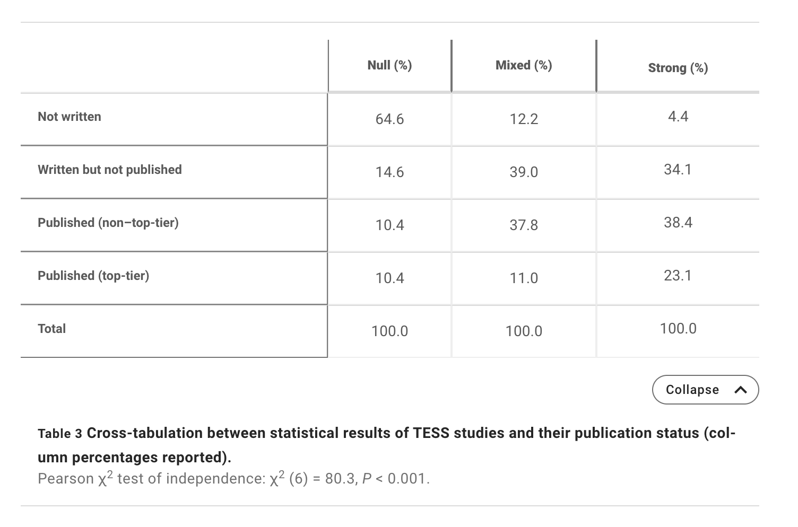

# File drawer effect  {-}

## Roadmap {-}

- Take-home messages from *p*-hacking exercise
- Discussion about the file drawer effect
  - [@Rosenthal1979-zi](https://doi.org/10.1037/0033-2909.86.3.638)
  - [@Franco2014-yu](http://dx.doi.org/10.1126/science.1255484)
- Work session on final project [proposals](https://psu-psychology.github.io/psych-490-reproducibility-2023-spring/final_project.html), [due Thursday, March 2]{.orange_due}.

## On *p*-hacking {-}

- What did we learn?
- Does the economy do better or worse under Republican or Democratic control?
- Does the answer depend on what measures (of political control, of economic performance) used?
- When does it matter if someone reporting on an issue engaged in *p*-hacking?

## File drawer effect {-}

```{r, fig.cap="https://www.craigmarker.com/wp-content/uploads/2006/12/filedrawer1-1002x675.jpg"}
knitr::include_graphics("https://www.craigmarker.com/wp-content/uploads/2006/12/filedrawer1-1002x675.jpg")
```

Related to the notion of 'negative data':

```{r, fig.cap="[@Hypothesis2021-qc](https://www.youtube.com/watch?v=9I1qR8PTr54)", out.width="100%"}
knitr::include_url("https://www.youtube.com/embed/9I1qR8PTr54")
```

### Simulating the file drawer effect {-}

- How many times out of $n$ experiments do we get...
  - a significant result
  - a non-significant result
  
Simulation app: <https://rogilmore.shinyapps.io/PSYCH490-2023-APES/>

- Pick small effect size $d=0.30$
  - There is a **true** effect, $B > A$
- Pick samples of $n=30$

## Discuss [@Rosenthal1979-zi](https://doi.org/10.1037/0033-2909.86.3.638) {-}

### Abstract {-}

>For any given research area, one cannot tell how many studies have been conducted
but never reported. The extreme view of the "file drawer problem" is
that journals are filled with the 5% of the studies that show Type I errors,
while the file drawers are filled with the 95% of the studies that show nonsignificant
results. Quantitative procedures for computing the tolerance for filed
and future null results are reported and illustrated, and the implications are
discussed.
>
>-- [@Rosenthal1979-zi](https://doi.org/10.1037/0033-2909.86.3.638)

>The extreme view of this problem, the "file drawer problem," is that the journals are filled with the 5% of the studies that show Type I errors, while the file drawers back at the lab are filled with the 95% of the studies that show nonsignificant (e.g., p > .05) results.
>
>-- [@Rosenthal1979-zi](https://doi.org/10.1037/0033-2909.86.3.638)

::: {.infobox}

Rosenthal's illustration relies on the *standard normal deviate* or $Z$, which is the value on a standard normal distribution (with mean $\mu=0$ and standard deviation $\sigma=1$) that one would need to observe for a given *p* value.

```{r, fig.cap="Illustration of $Z$ discussed in [@Rosenthal1979-zi](https://doi.org/10.1037/0033-2909.86.3.638)", out.width="100%", echo=TRUE}
n <- 1000
p_val <- 0.05
df <- tibble::tibble(x = rnorm(n, mean = 0, sd = 1))
qt_05 <- qt(p_val, n, lower.tail = FALSE)
ggplot(df) +
  aes(x) +
  geom_histogram(bins = 20) +
  geom_vline(xintercept = qt_05) +
  ggtitle(paste0("Z=", format(qt_05, digits = 3, nsmall = 2), " for p=", format(p_val, digits = 3, nsmall = 2), " and n=", n))
```

:::

### Findings {-}

>If the overall level of significance of the research review will be brought down to the level of just significant by the addition of just a few more null results, the finding is not resistant to
the file drawer threat.
>
>-- [@Rosenthal1979-zi](https://doi.org/10.1037/0033-2909.86.3.638)

>There is both a sobering and a cheering lesson to be learned from careful study of Equation 3. The sobering lesson is that small numbers of studies that are not very significant, even when their combined *p* is significant, may well be misleading in that only a few studies filed away could change the combined significant result to a nonsignificant one...The cheering lesson is that when the number of studies available grows large or the mean directional Z grows large, the file drawer hypothesis as a plausible rival hypothesis can be safely ruled out.
>
>-- [@Rosenthal1979-zi](https://doi.org/10.1037/0033-2909.86.3.638)

## Discuss [@Franco2014-yu](http://dx.doi.org/10.1126/science.1255484) {-}

Franco, A., Malhotra, N. & Simonovits, G. (2014). Social science. Publication bias in the social sciences: unlocking the file drawer. *Science*, *345*(6203), 1502–1505. https://doi.org/10.1126/science.1255484

### Abstract {-}

>We studied publication bias in the social sciences by analyzing a known population of conducted studies—221 in total—in which there is a full accounting of what is published and unpublished. We leveraged Time-sharing Experiments in the Social Sciences (TESS), a National Science Foundation–sponsored program in which researchers propose survey-based experiments to be run on representative samples of American adults. Because TESS proposals undergo rigorous peer review, the studies in the sample all exceed a substantial quality threshold. Strong results are 40 percentage points more likely to be published than are null results and 60 percentage points more likely to be written up. We provide direct evidence of publication bias and identify the stage of research production at which publication bias occurs: Authors do not write up and submit null findings.
>-- [@Franco2014-yu](http://dx.doi.org/10.1126/science.1255484)

### Findings {-}

```{r, fig.cap="Table 3 from [@Franco2014-yu](http://dx.doi.org/10.1126/science.1255484)", out.width="100%"}

```

### Solutions {-}

>How can the social science community combat publication bias of this sort? On the basis of communications with the authors of many experiments that resulted in null findings, we found that **some researchers anticipate the rejection of such papers but also that many of them simply lose interest in “unsuccessful” projects**. These findings show that a vital part of developing institutional solutions to improve scientific transparency would be to understand better the motivations of researchers who choose to pursue projects as a function of results.
>
>Few null findings ever make it to the review process. Hence, proposed solutions such as **two-stage review** (the first stage for the design and the second for the results), **pre-analysis plans** (41), and **requirements to preregister studies** (16) should be complemented by **incentives not to bury statistically insignificant results in file drawers**. **Creating high-status publication outlets for these studies** could provide such incentives. The movement toward open-access journals may provide space for such articles. Further, the pre-analysis plans and registries themselves will increase researcher access to null results. Alternatively, funding agencies could **impose costs on investigators who do not write up the results of funded studies**. Last, resources should be deployed for replications of published studies if they are unrepresentative of conducted studies and more likely to report large effects.
>
>-- [@Franco2014-yu](http://dx.doi.org/10.1126/science.1255484)

### Replication notes {-}

- Paper was behind the standard *Science* paywall.
- Data & code shared on Zenodo <https://doi.org/10.5281/zenodo.11300>
- Let's try to run it...

```{r}
###############################################################################
###############################################################################
# Publication Bias in the Social Sciences: Unlocking the File Drawer
# (Annie Franco, Neil Malhotra, Gabor Simonovits)
###############################################################################
###############################################################################
# REPLICATION CODE (SUPPLEMENTARY MATERIAL)
###############################################################################
# Fig. S1. Sensitivity of Pearson chi-squared test of independence in Table 3 to
# misclassification of TESS studies. 
###############################################################################

library(foreign)


# load dataset
pubbias <- read.dta("franco-etal-2014/filedrawer.dta") # changed path to .dta file
names(pubbias)

bounds <- as.matrix(table(pubbias$anyresults, pubbias$written))
rownames(bounds)<-c("Null", "Significant")
colnames(bounds)<-c("Unwritten", "Written")

chisq.test(bounds)

x <- seq(0,20,1)
y <- seq(0,70,1)

grid <- as.matrix(expand.grid(x, y))

chisq_pval <- function(q) {
  
  a<-q[1]
  b<-q[2]
  x<- cbind(c(a,-a), c(-b,b))
  chisq.test(bounds-x)$p.value
  
}

pvalues <- apply(grid, 1, FUN = chisq_pval)

sensitivity <- data.frame(unwritten = grid[,1], 
                          written = grid[,2], 
                          pvalue = pvalues)

sensitivity$sig <- as.numeric(sensitivity$pvalue<0.05)

# Changed path in next line
pdf(file = "franco-etal-2014/bounds.pdf", width=6.8, height=4.2)
par(mfrow=c(1,1), bg="white", mgp=c(2,.5,0), mar=c(4,4,2,2))
with(sensitivity[sensitivity$pvalue<0.05,], 
     plot(written, unwritten, 
          xlim=c(0,70), 
          cex=0.7,
          ylim=c(0,20),
          pch=16, 
          col="black", 
          axes=FALSE,
          cex.axis=0.9,
          cex.lab=1.1,
          ylab="",
          xlab="Written studies recoded as null (out of 159)"))
title(ylab="Unwritten studies recoded\nas significant (out of 31)", 
      line=1.5, cex.lab=1.1)
axis(side=1, tick=T, at=seq(0,100,10), cex.axis=0.8)
axis(side=2, tick=T, at=seq(0,100,10), cex.axis=0.8)
with(sensitivity[sensitivity$pvalue>0.05,], 
     points(written, unwritten, col="black", pch=1, cex=0.7))
box()
legend("topright", 
       c("P-value < 0.05", "P-value > 0.05"),
       pch=c(16,1), cex=0.95)
dev.off()
```

```{r, fig.cap="Figure generated from code in https://doi.org/10.5281/zenodo.11300", out.width="100%"}
knitr::include_graphics("franco-etal-2014/bounds.pdf")
```

- So, we can regenerate one of the figures (S1, p. 6) in the [Supplemental Material](https://www.science.org/doi/suppl/10.1126/science.1255484/suppl_file/franco.sm.pdf).

::: {.infobox}

More could be done with these data. This could be a final project for someone.

:::

## Next time... {-}

- Negligence
    - [@Ritchie2020-fm], Chapter 5
    - [@Nuijten2015-ul](https://doi.org/10.3758/s13428-015-0664-2)
    - [@Szucs2017-fc](http://dx.doi.org/10.1371/journal.pbio.2000797)
- Work session on final project [proposals](https://psu-psychology.github.io/psych-490-reproducibility-2023-spring/final_project.html), [due Thursday, March 2]{.orange_due}.
