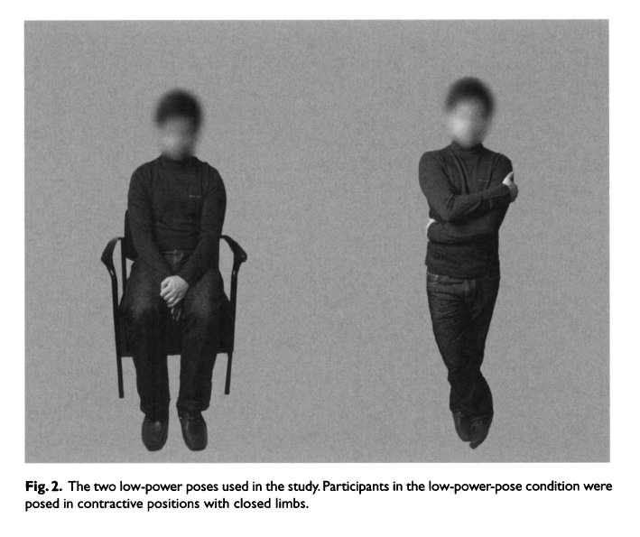

# Hype  {-}

## In the news {-}

Youyou, W., Yang, Y. & Uzzi, B. (2023). A discipline-wide investigation of the replicability of Psychology papers over the past two decades. *Proceedings of the National Academy of Sciences of the United States of America*, *120*(6), e2208863120. https://doi.org/10.1073/pnas.2208863120

>Conjecture about the weak replicability in social sciences has made scholars eager to quantify the scale and scope of replication failure for a discipline. Yet small-scale manual replication methods alone are ill-suited to deal with this big data problem. Here, we conduct a discipline-wide replication census in science. Our sample (N = 14,126 papers) covers nearly all papers published in the six top-tier Psychology journals over the past 20 y. Using a validated machine learning model that estimates a paper’s likelihood of replication, we found evidence that both supports and refutes speculations drawn from a relatively small sample of manual replications. First, we find that **a single overall replication rate of Psychology poorly captures the varying degree of replicability among subfields**. Second, we find that **replication rates are strongly correlated with research methods** in all subfields. **Experiments replicate at a significantly lower rate than do non-experimental studies**. Third, we find that **authors’ cumulative publication number and citation impact are positively related to the likelihood of replication**, while other proxies of research quality and rigor, such as an author’s university prestige and a paper’s citations, are unrelated to replicability. Finally, contrary to the ideal that media attention should cover replicable research, we find that **media attention is positively related to the likelihood of replication failure**. Our assessments of the scale and scope of replicability are important next steps toward broadly resolving issues of replicability.
>
>-- [@Youyou2023-dh](http://dx.doi.org/10.1073/pnas.2208863120)

## Roadmap {-}

- Discuss
    - [@Ritchie2020-fm], Chapter 6
    - [@Carney2010-gq](http://dx.doi.org/10.1177/0956797610383437)
    - (Optional) [@Ranehill2015-dj](http://dx.doi.org/10.1177/0956797614553946)
- Watch/discuss
    - [@Cuddy2012-zx](https://www.ted.com/talks/amy_cuddy_your_body_language_may_shape_who_you_are)
- [Due]{.orange_due}
    - Final project [proposals](https://psu-psychology.github.io/psych-490-reproducibility-2023-spring/final_project.html).
- Reminder 
    - [Assignment]{.green_assigned} [Exercise 03: Alpha, Power, Effect Sizes, & Sample Size](https://psu-psychology.github.io/psych-490-reproducibility-2023-spring/ex_apes.html), [due Tuesday, March 16]{.orange_due} 

::: {.infobox}

The *New York Times* published an article ([@Dominus2017-th](https://www.nytimes.com/2017/10/18/magazine/when-the-revolution-came-for-amy-cuddy.html)) on the controversy surrounding Dr. Cuddy's work called "When the Revolution Came for Amy Cuddy."

I considered reading this and discussing it, but I was more interested in the substantive claims made in the papers and in the talk.

Reading the Times' story would make a great final project topic, however.

:::

## [@Ritchie2020-fm], Chapter 6 {-}

- Problems with scientific press releases
    - Not written by scientists
    - give unwarranted advice
    - cross-species leaps or generalizations
    - equating correlation with causation
    
- "Churnalism"
    - Journalists do not do their own investigations but repeat press releases
    
- Popular books (by scientists, too) can gloss over complexities, nuances

- Positive rhetoric/spin

- Counter-example from OPERA study of faster-than-light particle

## [@Carney2010-gq](http://dx.doi.org/10.1177/0956797610383437) {-}

Carney, D. R., Cuddy, A. J. C. & Yap, A. J. (2010). Power posing: brief nonverbal displays affect neuroendocrine levels and risk tolerance. Psychological Science, 21(10), 1363–1368. https://doi.org/10.1177/0956797610383437

>Humans and other animals express power through open, expansive postures, and they express powerlessness through contractive postures. But can these postures actually cause power? The results of this study confirmed our prediction posing in high-power nonverbal displays (as opposed to low-power nonverbal displays) would cause neuroendocrine behavioral changes for both male and female participants: High-power posers experienced elevations in testosterone, decreases in cortisol, and increased feelings of power and tolerance for risk; low-power posers exhibited the opposite pattern. In posing in displays of power caused advantaged and adaptive psychological, physiological, and behavioral changes, and findings suggest that embodiment extends beyond mere thinking and feeling, to physiology and subsequent behavioral That a person can, by assuming two simple 1-min poses, embody power and instantly become more powerful has real-actionable implications.
>
>-- [@Carney2010-gq](http://dx.doi.org/10.1177/0956797610383437)

### Methods {-}

- $n=42$ participants (26 female; age or other demographic characteristics?)
- Assigned into two groups (high power vs. low power)
- Experimenter posed bodies
- Two different poses held for 1 min

```{r, out.width="100%", fig.cap="High power poses. Figure 1 from [@Carney2010-gq](http://dx.doi.org/10.1177/0956797610383437)"}
knitr::include_graphics("include/img/carney-etal-fig01.png")
```

```{r, out.width="100%", fig.cap="Low power poses. Figure 2 from [@Carney2010-gq](http://dx.doi.org/10.1177/0956797610383437)"}

```

- Other tasks/measures
    - Gambling task (risk-taking, powerful feelings)
    - Self-reported feelings of power
    - Saliva samples (pretest and ~ 17 min after pose)
        - Tested for cortisol, testosterone
    
### Results {-}

```{r, out.width="100%", fig.cap="[@Carney2010-gq](http://dx.doi.org/10.1177/0956797610383437)"}
knitr::include_graphics("include/img/carney-etal-2010-results.png")
```

```{r, out.width="100%", fig.cap="Figure 3 from [@Carney2010-gq](http://dx.doi.org/10.1177/0956797610383437)"}
knitr::include_graphics("include/img/carney-etal-fig03.png")
```

### Citation data

Paper cited ~1,500 times (https://scholar.google.com/scholar?hl=en&as_sdt=0%2C39&q=Power+posing%3A+brief+nonverbal+displays+affect+neuroendocrine+levels+and+risk+tolerance&btnG=) according to Google Scholar on 2023-03-01.

### Reproducibility notes {-}

- Article was behind a paywall.
- PDF was available via authenticated access to PSU Libraries.
- No data are shared; no code used to make the figures or conduct the analyses were shared.

### Presentation comments {-}

- Better to show individual participant data points (see below)

## [@Cuddy2012-zx](https://www.ted.com/talks/amy_cuddy_your_body_language_may_shape_who_you_are)  {-}

```{r, out.width="100%", fig.cap="Amy Cuddy's TED talk: https://www.ted.com/talks/amy_cuddy_your_body_language_may_shape_who_you_are"}
knitr::include_graphics("include/img/cuddy-ted.png")
```

### Citation data

Talk viewed ~67 million times according to TED web page on 2023-03-01.

## [@Ranehill2015-dj](http://dx.doi.org/10.1177/0956797614553946) {-}

Ranehill, E., Dreber, A., Johannesson, M., Leiberg, S., Sul, S. & Weber, R. A. (2015). Assessing the robustness of power posing: no effect on hormones and risk tolerance in a large sample of men and women [Review of Assessing the robustness of power posing: no effect on hormones and risk tolerance in a large sample of men and women]. *Psychological Science*, *26*(5), 653–656. journals.sagepub.com. https://doi.org/10.1177/0956797614553946

>We conducted a conceptual replication study task in both the gain dom with a similar methodology as that employed by Carney loss domain. In t et al. but using a substantially larger sample (N= 200) and a design in which the experimenter was blind to condition. Our statistical power to detect an effect of the magnitude reported by Carney et al. was more than 95% (see the Supplemental Material available online). In addition to the three outcome measures that Carney et al. used, we  also studied two more behavioral tasks (risk taking in the loss domain and willingness to compete).
>
>Consistent with the findings of Carney et al., our results showed a significant effect of power posing on self-reported feelings of power. However, we found no significant effect of power posing on hormonal levels in any of the three behavioral tasks.
>
>-- [@Ranehill2015-dj](http://dx.doi.org/10.1177/0956797614553946)

### Methods {-}

- Sampled $n=100$ after power analysis; then sampled another 100.
- 3 min pose durations
- Participants modeled poses following computer instructions.
- No deception.

### Results {-}

```{r, out.width="100%", fig.cap="Results excerpt from [@Ranehill2015-dj](http://dx.doi.org/10.1177/0956797614553946)"}
knitr::include_graphics("include/img/ranehill-etal-2015-results.png")
```

```{r, out.width="100%", fig.cap="Figure 1 from [@Ranehill2015-dj](http://dx.doi.org/10.1177/0956797614553946)"}
knitr::include_graphics("include/img/ranehill-etal-2015-fig01.png")
```

### Citation data

Paper cited ~314 times (https://scholar.google.com/scholar?hl=en&as_sdt=0%2C39&q=Assessing+the+robustness+of+power+posing%3A+no+effect+on+hormones+and+risk+tolerance+in+a+large+sample+of+men+and+women+%5BReview+of+Assessing+the+robustness+of+power+posing%3A+no+effect+on+hormones+and+risk+tolerance+in+a+large+sample+of+men+and+women%5D&btnG=) according to Google Scholar on 2023-03-01.

### Reproducibility notes {-}

- Article was behind a paywall.
- The PDF was available via authenticated access to PSU Libraries.
- The PDF did not easily permit cutting and pasting of text, so it was hard to excerpt those for this document.
- The HTML version of the article was unavailable, so I had to make screenshots of figures.
- There is an [OSF site](https://osf.io/6akvt) with data and materials.
    - The OSF site includes very helpful details about the experiments.
    - The data and code were shared, but I don't have access to the statistical program used (Stata) to rerun the analysis. The data had a `.dta` file extension. This appears to be a plain text, 'tidy' data file format that could be used by another program.

### Presentation comments {-}

It's better to show individual participant data points in a 'spaghetti' plot.
That way the read can see both the group effect and how individual participants fared.
Here's an example with made-up data.

```{r, out.width="100%", fig.cap="Example of 'spaghetti' plot."}
measure <- c(1, .8, 1.2, 1.1, .7, .75, 1.1, 1, 1.15, 1.05, .75, .8)
time <- c(1, 1, 1, 1, 1, 1, 2, 2, 2, 2, 2, 2)
group <- c('a', 'a', 'a', 'b', 'b', 'b', 'a', 'a', 'a', 'b', 'b', 'b')
sub_id <- c(1, 2, 3, 4, 5, 6, 1, 2, 3, 4, 5, 6)
df <- data.frame(sub_id = sub_id, pre_test = pre, post_test = post, test_group = group)

library(ggplot2)
df |>
  ggplot() +
  aes(x = time, y = measure, group = sub_id, color = test_group) +
  geom_point() +
  geom_line() +
  facet_grid(~ test_group)
```

## Exploring logical/causal diagrams {-}

Causal diagrams are one tool to reveal an authors' claims and assumptions.

```{r, out.width="100%", fig.cap="Implicit causal model tested"}
# https://kateto.net/network-visualization
nodes <- data.frame(id = c('01', '02', '03'), label = c("feelings", "behaviors", "physiology"))
edges <- data.frame(from = c('02', '02'), to = c('01', '03'))
net <- igraph::graph_from_data_frame(d = edges, vertices = nodes, directed = T)
plot(net, vertex.size = 80, vertex.shape = 'rectangle', vertex.color = 'white', edge.curved = .5)
```
More typically, we think that feelings cause behaviors.

```{r, out.width="100%", fig.cap="Conventional causal model"}
nodes <- data.frame(id = c('01', '02', '03'), label = c("feelings", "behaviors", "physiology"))
edges <- data.frame(from = c('01'), to = c('02'))
net <- igraph::graph_from_data_frame(d = edges, vertices = nodes, directed = T)
plot(net, vertex.size = 80, vertex.shape = 'rectangle', vertex.color = 'white', edge.curved = .5)
```

Or that feelings and physiological responses (e.g., hormones like cortisol and testosterone) together influence behaviors.

```{r, out.width="100%", fig.cap="Conventional causal model II"}
nodes <- data.frame(id = c('01', '02', '03'), label = c("feelings", "behaviors", "physiology"))
edges <- data.frame(from = c('01', '01', '03', '03'), to = c('02', '03', '01', '02'))
net <- igraph::graph_from_data_frame(d = edges, vertices = nodes, directed = T)
plot(net, vertex.size = 80, vertex.shape = 'rectangle', vertex.color = 'white', edge.curved = .5)
```

Neuroscientists might argue that feelings are the *outcome* of physiological processes like hormone levels and nervous system activity. Also, physiological processes influence one another.

```{r, out.width="100%", fig.cap="Neuroscience-oriented causal model"}
nodes <- data.frame(id = c('01', '02', '03'), label = c("feelings", "behaviors", "physiology"))
edges <- data.frame(from = c('03', '03', '03'), to = c('02', '01', '03'))
net <- igraph::graph_from_data_frame(d = edges, vertices = nodes, directed = T)
plot(net, vertex.size = 80, vertex.shape = 'rectangle', vertex.color = 'white', edge.curved = .5)
```

To understand the full system of influences, we might need to look at a more complicated causal model. Here, behaviors influence and are influenced by physiology. Behaviors influence, and are influenced by feelings through influences on physiology. However, the evidence presented in [@Carney2010-gq](http://dx.doi.org/10.1177/0956797610383437) and  [@Ranehill2015-dj](http://dx.doi.org/10.1177/0956797614553946) show that 'posing' behavior influences feelings, but not (hormonal) physiology. If the neuroscientific view is correct, there must be another route for behaviors to influence feeling through physiology. That route is probably nervous system activity.

```{r, out.width="100%", fig.cap="Plausible fully interactive causal model"}
nodes <- data.frame(id = c('01', '02', '03'), label = c("feelings", "behaviors", "physiology"))
edges <- data.frame(from = c('03', '03', '03', '02', '01'), to = c('02', '01', '03', '03', '03'))
net <- igraph::graph_from_data_frame(d = edges, vertices = nodes, directed = T)
plot(net, vertex.size = 80, vertex.shape = 'rectangle', vertex.color = 'white', edge.curved = .5)
```

## Next time... {-}

- Solutions
- Read
    - [@munafo_manifesto_2017](https://doi.org/10.1038/s41562-016-0021)
    - [@Begley2013-vm](http://dx.doi.org/10.1038/497433a)