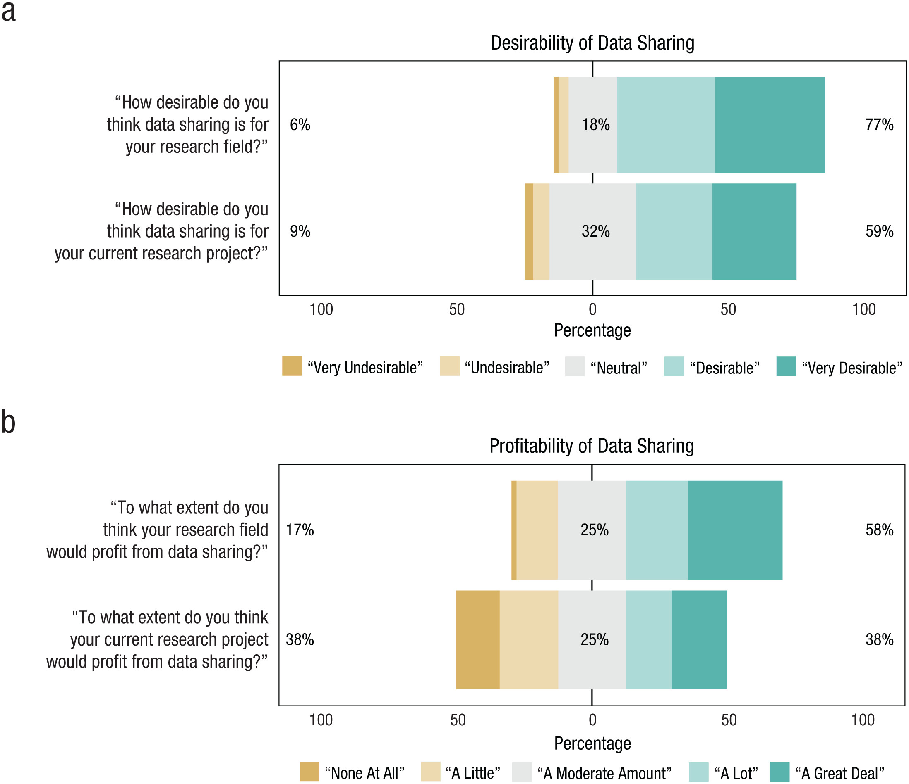
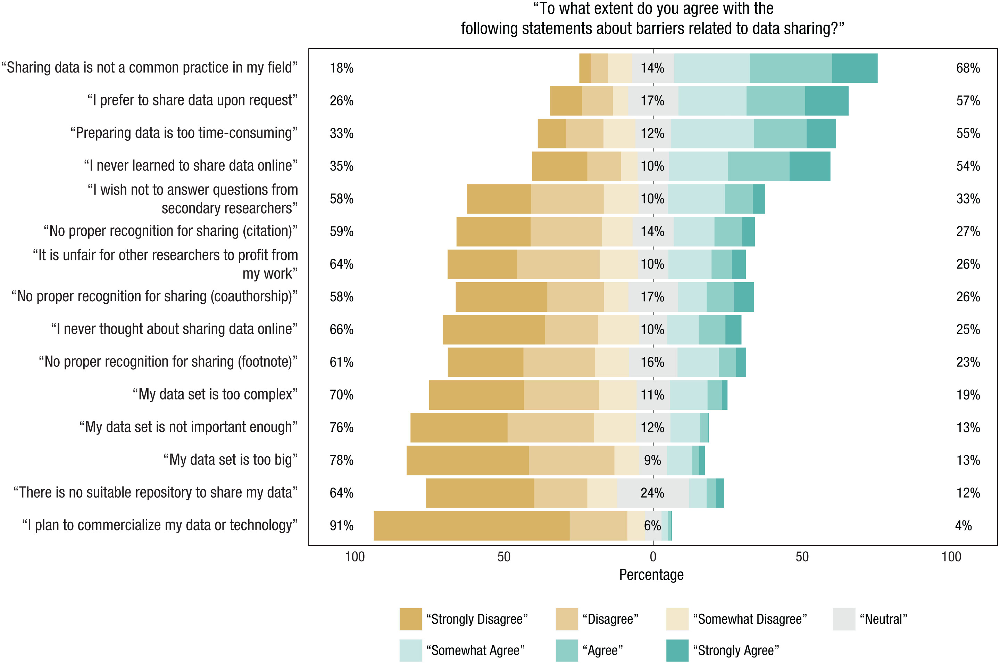
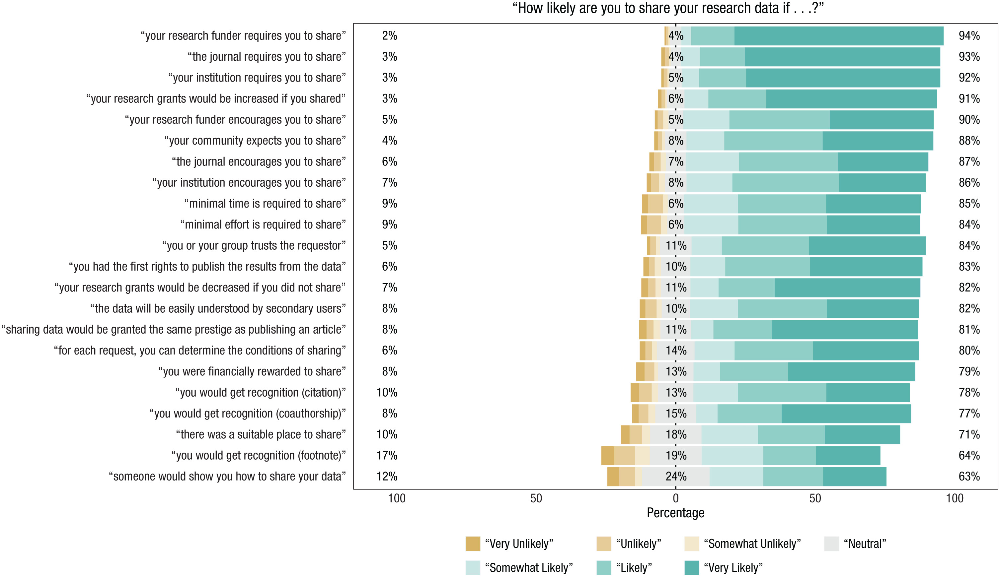

# Data sharing {-}

## Roadmap {-}

- [@Houtkoop2018-tl](https://doi.org/10.1177/2515245917751886)
- [@Tenopir2020-mq](http://dx.doi.org/10.1371/journal.pone.0229003)
- (Optional) [@GilmoreAdolph2017](https://doi.org/10.1038/s41562-017-0128)
- (Optional) [@Meyer2018-vk](https://doi.org/10.1177/2515245917747656)
- (Optional) [@National_Institutes_of_Health_undated-it](https://grants.ni

## [@Houtkoop2018-tl](https://doi.org/10.1177/2515245917751886) {-}

Houtkoop, B. L., Chambers, C., Macleod, M., Bishop, D. V. M., Nichols, T. E. & Wagenmakers, E.-J. (2018). Data sharing in psychology: A survey on barriers and preconditions. *Advances in Methods and Practices in Psychological Science*, *1*(1), 70–85. https://doi.org/10.1177/2515245917751886

```{r, out.width="100%", fig.cap="Figure 1 from [@Houtkoop2018-tl](https://doi.org/10.1177/2515245917751886). Responses to the survey questions on the (a) desirability and (b) profitability of data sharing for the researchers’ own fields and their own current projects. For each statement in (a), the number to the left of the data bar indicates the percentage of researchers who responded with “very undesirable” or “undesirable,” the number in the center of the data bar indicates the percentage who responded with “neutral,” and the number to the right of the data bar indicates the percentage who responded with “desirable” or “very desirable.” For each statement in (b), the number to the left of the data bar indicates the percentage of researchers who responded with “none at all” or “a little,” the number in the center of the data bar indicates the percentage who responded with “a moderate amount,” and the number to the right of the data bar indicates the percentage who responded with “a lot” or “a great deal.” This figure was created using the likert package in R (Bryer & Speerschneider, 2015)."}

```

```{r, out.width="100%", fig.cap="Figure 2 from [@Houtkoop2018-tl](https://doi.org/10.1177/2515245917751886). Responses to the survey questions asking respondents to indicate the extent to which the 15 non-fear-related barriers kept them from sharing their research data. For each statement, the number to the left of the data bar indicates the percentage of researchers who responded with “strongly disagree,” “disagree,” or “somewhat disagree”; the number in the center of the data bar indicates the percentage of researchers who responded with “neutral”; and the number to the right of the data bar indicates the percentage who responded with “somewhat agree,” “agree,” or “strongly agree.” The statements are ordered according to the percentage of agreement (greatest agreement at the top). This figure was created using the likert package in R (Bryer & Speerschneider, 2015)."}

```

```{r, out.width="100%", fig.cap="Figure 3 from [@Houtkoop2018-tl](https://doi.org/10.1177/2515245917751886). Responses to the survey questions asking researchers to indicate the extent to which the six fear-related barriers kept (a) themselves or (b) other researchers from sharing their data. For each statement, the number to the left of the data bar indicates the percentage of researchers who responded with “strongly disagree,” “disagree,” or “somewhat disagree”; the number in the center of the data bar indicates the percentage who responded with “neutral”; and the number to the right of the data bar indicates the percentage who responded with “somewhat agree,” “agree,” or “strongly agree.” In each panel, the statements are ordered according to the percentage of agreement (greatest agreement at the top). This figure was created using the likert package in R (Bryer & Speerschneider, 2015)."}

```

```{r, out.width="100%", fig.cap="Figure 4 from [@Houtkoop2018-tl](https://doi.org/10.1177/2515245917751886). Responses to the survey questions asking researchers to indicate how likely they would be to share their data under several conditions. For each statement, the number to the left of the data bar indicates the percentage of researchers who responded with “very unlikely,” “unlikely,” or “somewhat unlikely”; the number in the center of the data bar indicates the percentage who responded with “neutral”; and the number to the right of the data bar indicates the percentage who responded with “somewhat likely,” “likely,” or “very likely.” The statements are ordered according to the percentage of agreement (greatest agreement at the top). This figure was created using the likert package in R (Bryer & Speerschneider, 2015)."}

```

### Study conclusions {-}

>•	Public data sharing is not a common practice among research psychologists.
>
>•	Respondents considered data sharing to be both desirable and profitable for their particular research fields, but somewhat less desirable and profitable in the case of their own current research projects.
>
>•	The non-fear-related barriers to data sharing most frequently reported by respondents were that (a) sharing is not a common practice in their field, (b) they prefer to share their data only upon request, (c) they consider preparing data for sharing to be excessively time-consuming, and (d) they have never learned to share data online.
>
>•	Respondents believed that the largest fear-related obstacles preventing other researchers from sharing their data are the fear that alternative analyses might expose invalid conclusions and the fear of loss of control.
>
>•	Respondents reported that their greatest fears about sharing their own data are that the data might be misinterpreted and they might be scooped.
>
>•	In general, respondents felt that fear-related barriers affected other researchers more strongly than themselves.
>
>•	Mandatory data sharing (enforced by institutions, journals, or funders) and financial encouragement (i.e., increased grant amounts) are measures that would apparently be highly effective in increasing researchers’ willingness to share their data.
>
>-- [@Houtkoop2018-tl](https://doi.org/10.1177/2515245917751886)

### Transparency & reproducibility notes {-}

- Study preregistered
- Data shared

## Penn State researchers {- #psu-survey-2022}

- GitHub repo: <https://github.com/penn-state-open-science/survey-fall-2022>
- Faculty, staff, students and administrators ($n=100$)
- Protocol (IRB & data analysis): <https://penn-state-open-science.github.io/survey-fall-2022/>

### Sharing with collaborators {- #psu-share-collaborators}

```{r, out.width="100%", fig.cap="Figure 22.10 from https://penn-state-open-science.github.io/survey-fall-2022/"}
knitr::include_graphics("https://penn-state-open-science.github.io/survey-fall-2022/include/img/fig-import-share-collab-1.png")
```

- [Barriers to sharing](https://penn-state-open-science.github.io/survey-fall-2022/data-visualization.html#barriers-to-sharing-with-research-collaborators)

### Where store data {- #psu-where-store}

```{r, out.width="100%", fig.cap="Figure 22.9 from https://penn-state-open-science.github.io/survey-fall-2022/"}
knitr::include_graphics("https://penn-state-open-science.github.io/survey-fall-2022/include/img/fig-data-storage-places-1.png")
```

```{r, out.width="100%", fig.cap="Figure 22.15 from https://penn-state-open-science.github.io/survey-fall-2022/"}
knitr::include_graphics("https://penn-state-open-science.github.io/survey-fall-2022/include/img/fig-where-data-shared-1.png")
```

### Sharing with research community {- #psu-share-community}

```{r, out.width="100%", fig.cap="Figure 22.11 from https://penn-state-open-science.github.io/survey-fall-2022/"}
knitr::include_graphics("https://penn-state-open-science.github.io/survey-fall-2022/include/img/fig-import-share-community-1.png")
```


```{r, out.width="100%", fig.cap="Figure 22.12 from https://penn-state-open-science.github.io/survey-fall-2022/"}
knitr::include_graphics("https://penn-state-open-science.github.io/survey-fall-2022/include/img/fig-obstacles-to-sharing-w-comm-1.png")
```


```{r, out.width="100%", fig.cap="Figure 22.15 from https://penn-state-open-science.github.io/survey-fall-2022/"}
knitr::include_graphics("https://penn-state-open-science.github.io/survey-fall-2022/include/img/fig-where-data-shared-1.png")
```

## [@Tenopir2020-mq](http://dx.doi.org/10.1371/journal.pone.0229003)

### Fields {-}

```{r, out.width="100%", fig.cap="Table 1 from [@Tenopir2020-mq](http://dx.doi.org/10.1371/journal.pone.0229003)"}
knitr::include_graphics("https://journals.plos.org/plosone/article/file?id=10.1371/journal.pone.0229003.t001&type=large")
```

### Where data are stored {-}

```{r, out.width="100%", fig.cap="Table 2 from [@Tenopir2020-mq](http://dx.doi.org/10.1371/journal.pone.0229003)"}
knitr::include_graphics("https://journals.plos.org/plosone/article/file?id=10.1371/journal.pone.0229003.t002&type=large")
```

### Practices, perceptions, & barriers {-}

- Table 7 from [@Tenopir2020-mq](http://dx.doi.org/10.1371/journal.pone.0229003): <https://doi.org/10.1371/journal.pone.0229003.t007>

```{r, out.width="100%", fig.cap="Table 7 from [@Tenopir2020-mq](http://dx.doi.org/10.1371/journal.pone.0229003)"}
knitr::include_graphics("https://journals.plos.org/plosone/article/file?id=10.1371/journal.pone.0229003.t007&type=large")
```

```{r, out.width="100%", fig.cap="Table 8 from [@Tenopir2020-mq](http://dx.doi.org/10.1371/journal.pone.0229003)"}
knitr::include_graphics("https://journals.plos.org/plosone/article/file?id=10.1371/journal.pone.0229003.t008&type=large")
```

## Next time... {-}

- Materials, code, & protocol sharing
- Read
    - [@Soska2021-mh](http://dx.doi.org/10.7191/jeslib.2021.1208)
    - [@Gilroy2019-bf](http://dx.doi.org/10.1007/s40614-019-00202-5)
- Explore
    - [protocols.io](https://www.protocols.io/)
    - [Journal of Visualized Experiments (JOVE)](https://www.jove.com/)
