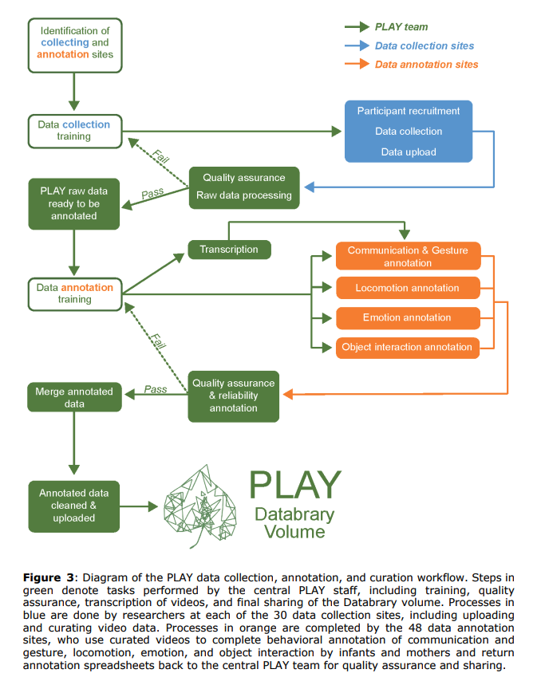
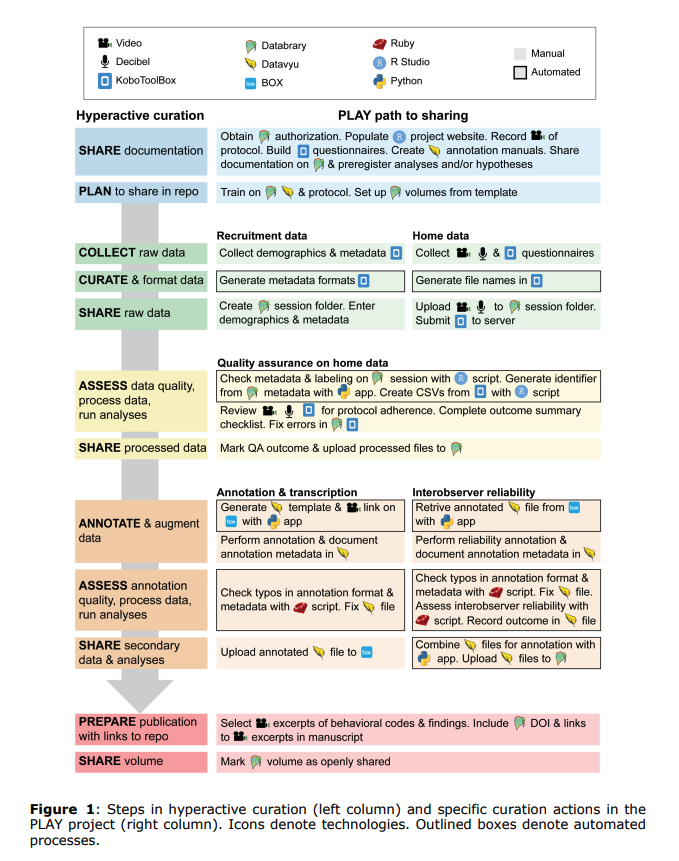
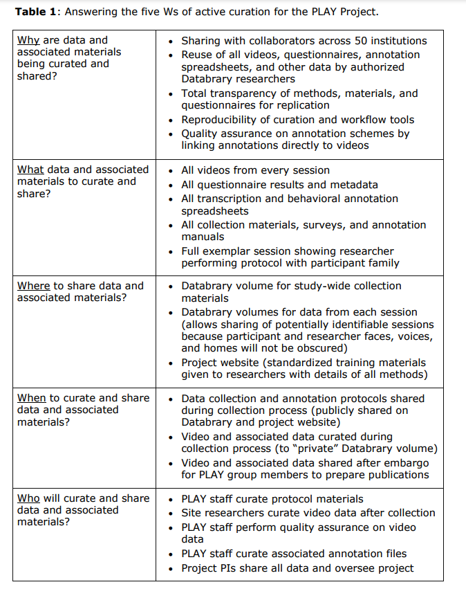

# Sharing materials, code, protocols {-}

## Roadmap {-}

- Materials, code, & protocol sharing
    - [@Soska2021-mh](http://dx.doi.org/10.7191/jeslib.2021.1208)
    - [@Gilroy2019-bf](http://dx.doi.org/10.1007/s40614-019-00202-5)
- Explore
    - [protocols.io](https://www.protocols.io/)
    - [Journal of Visualized Experiments (JOVE)](https://www.jove.com/)
- - [Assignment due this Thursday]{.orange_due}
    - [Exercise 05: Data and materials sharing](#ex_data_sharing)
    
## [@Roy2023-wl](http://dx.doi.org/10.1038/s41598-023-32445-3) {-}

Roy, S. & Edwards, M. A. (2023). NSF Fellows’ perceptions about incentives, research misconduct, and scientific integrity in STEM academia. *Scientific Reports*, *13*(1), 5701. https://doi.org/10.1038/s41598-023-32445-3

>Abstract
>
>There is increased concern about perverse incentives, quantitative performance metrics, and hyper-competition for funding and faculty positions in US academia. Recipients of the prestigious National Science Foundation Graduate Research Fellowships (n = 244) from Civil and Environmental Engineering (45.5%) and Computer Science and Engineering (54.5%) were anonymously surveyed to create a baseline snapshot of their perceptions, behaviors and experiences. NSF Fellows ranked scientific advancement as the top metric for evaluating academics followed by publishing in high-impact journals, social impact of research, and publication/citation counts. The self-reported rate of academic cheating was 16.7% and of research misconduct was 3.7%. Thirty-one percent of fellows reported direct knowledge of graduate peers cheating, and 11.9% had knowledge of research misconduct by colleagues. Only 30.7% said they would report suspected misconduct. A majority of fellows (55.3%) felt that mandatory ethics trainings left them unprepared for dealing with ethical issues. Fellows stated academic freedom, flexible schedules and opportunity to mentor students were the most positive aspects of academia, whereas pressures for funding, publication, and tenure were cited as the most negative aspects. These data may be useful in considering how to better prepare STEM graduate trainees for academic careers.
>
>-- [@Roy2023-wl](http://dx.doi.org/10.1038/s41598-023-32445-3) {-}

```{r, out.width="100%", fig.cap="Figure 1 from [@Roy2023-wl](http://dx.doi.org/10.1038/s41598-023-32445-3). Science and scientists. (A) NSF Fellows who believe research is or should be about truth-seeking, service to humanity, or self-advancement. (B) Criteria Fellows use to evaluate academic peers (ranked in decreasing order of importance). (C) Whether Fellows applied the same criteria for themselves?"}
knitr::include_graphics("https://media.springernature.com/full/springer-static/image/art%3A10.1038%2Fs41598-023-32445-3/MediaObjects/41598_2023_32445_Fig1_HTML.png?as=webp")
```

### Table 2 Top 10 pros and cons of STEM academia {-}

<https://www.nature.com/articles/s41598-023-32445-3/tables/2>

### Table 3 Academic cheating and research misconduct  {-}

<https://www.nature.com/articles/s41598-023-32445-3/tables/3>
   
## Databrary {-}

- <https://databrary.org>
- Open (not public) sharing, but restricted to authorized researchers
- [@GilmoreAdolph2017](https://doi.org/10.1038/s41562-017-0128)

### Play & Learning Across a Year (PLAY) Project {-}

- PLAY Project: <https://play-project.org>
- Survey data via [KoBoToolbox](https://kobotoolbox.org): <https://PLAY-behaviorome.github.io/KoBoToolbox>

## [@Soska2021-mh](http://dx.doi.org/10.7191/jeslib.2021.1208) {-}

```{r, out.width="100%", fig.cap="Figure 2 from [@Soska2021-mh](http://dx.doi.org/10.7191/jeslib.2021.1208)"}

```

```{r, out.width="100%", fig.cap="Figure 1 from [@Soska2021-mh](http://dx.doi.org/10.7191/jeslib.2021.1208)"}

```

```{r, out.width="100%", fig.cap="Table 1 from [@Soska2021-mh](http://dx.doi.org/10.7191/jeslib.2021.1208)"}

```

## Next time... {-}

- Open science tools
    - [@Kathawalla2021-tk](https://doi.org/10.1525/collabra.18684)
    - [@Cruwell2019-nz](https://doi.org/10.1027/2151-2604/a000387)
- [Assignment Due]{.orange_due}
    - [Exercise 05: Data and materials sharing](#ex_data_sharing)
