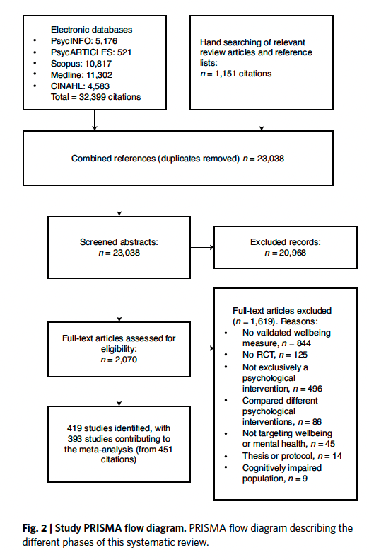
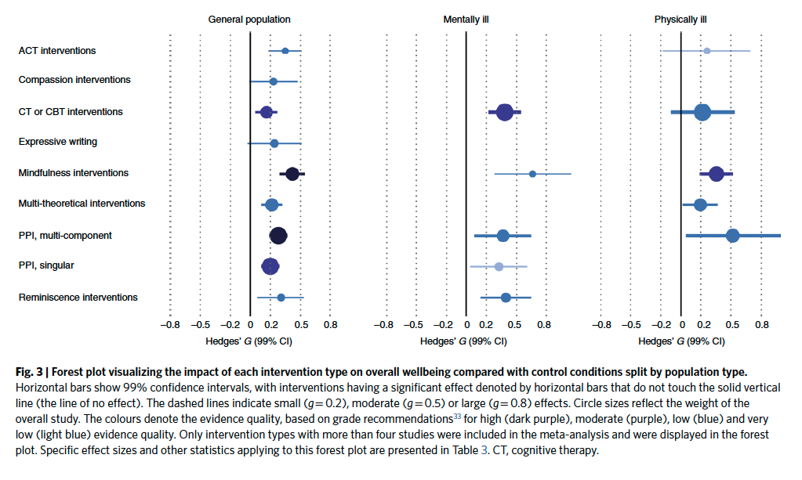

# Meta-analysis and many-analysts {-}

## Roadmap {-}

- Meta-analysis & many analysts
    - [@Wilson2014-ol](https://www.psychologicalscience.org/observer/introduction-to-meta-analysis-a-guide-for-the-novice)
    - [@Silberzahn2018-st](https://doi.org/10.1177/2515245917747646)
    
## Meta-analysis {-}

- Multiple studies
- What is the distribution of effect sizes?

### [@Van_Agteren2021-al](http://dx.doi.org/10.1038/s41562-021-01093-w) {-}

van Agteren, J., Iasiello, M., Lo, L., Bartholomaeus, J., Kopsaftis, Z., Carey, M. & Kyrios, M. (2021). A systematic review and meta-analysis of psychological interventions to improve mental wellbeing. *Nature Human Behaviour*. https://doi.org/10.1038/s41562-021-01093-w.

>Our current understanding of the efficacy of psychological interventions in improving mental states of wellbeing is incomplete. This study aimed to overcome limitations of previous reviews by examining the efficacy of distinct types of psychological interventions, irrespective of their theoretical underpinning, and the impact of various moderators, in a unified systematic review and meta-analysis. Four-hundred-and-nineteen randomized controlled trials from clinical and non-clinical populations (n = 53,288) were identified for inclusion. Mindfulness-based and multi-component positive psychological interventions demonstrated the greatest efficacy in both clinical and non-clinical populations. Meta-analyses also found that singular positive psychological interventions, cognitive and behavioural therapy-based, acceptance and commitment therapy-based, and reminiscence interventions were impactful. Effect sizes were moderate at best, but differed according to target population and moderator, most notably intervention intensity. The evidence quality was generally low to moderate. While the evidence requires further advancement, the review provides insight into how psychological interventions can be designed to improve mental wellbeing.
>
>-- [@Van_Agteren2021-al](http://dx.doi.org/10.1038/s41562-021-01093-w)

```{r, out.width="100%", fig.cap="Figure 2 from [@Van_Agteren2021-al](http://dx.doi.org/10.1038/s41562-021-01093-w)"}

```

```{r, out.width="100%", fig.cap="Figure 3 from [@Van_Agteren2021-al](http://dx.doi.org/10.1038/s41562-021-01093-w)"}

```

## [@Silberzahn2018-st](https://doi.org/10.1177/2515245917747646) {-}

>Abstract
>
>Twenty-nine teams involving 61 analysts used the same data set to address the same research question: whether soccer referees are more likely to give red cards to dark-skin-toned players than to light-skin-toned players. Analytic approaches varied widely across the teams, and the estimated effect sizes ranged from 0.89 to 2.93 (Mdn = 1.31) in odds-ratio units. Twenty teams (69%) found a statistically significant positive effect, and 9 teams (31%) did not observe a significant relationship. Overall, the 29 different analyses used 21 unique combinations of covariates. Neither analysts’ prior beliefs about the effect of interest nor their level of expertise readily explained the variation in the outcomes of the analyses. Peer ratings of the quality of the analyses also did not account for the variability. These findings suggest that significant variation in the results of analyses of complex data may be difficult to avoid, even by experts with honest intentions. Crowdsourcing data analysis, a strategy in which numerous research teams are recruited to simultaneously investigate the same research question, makes transparent how defensible, yet subjective, analytic choices influence research results.
>
>-- [@Silberzahn2018-st](https://doi.org/10.1177/2515245917747646)

```{r, out.width="100%", fig.cap="Figure 2 from [@Silberzahn2018-st](https://doi.org/10.1177/2515245917747646); Point estimates (in order of magnitude) and 95% confidence intervals for the effect of soccer players’ skin tone on the number of red cards awarded by referees. Reported results, along with the analytic approach taken, are shown for each of the 29 analytic teams. The teams are ordered so that the smallest reported effect size is at the top and the largest is at the bottom. The asterisks indicate upper bounds that have been truncated to increase the interpretability of the plot; the actual upper bounds of the confidence intervals were 11.47 for Team 21 and 78.66 for Team 27. OLS = ordinary least squares; WLS = weighted least squares."}
knitr::include_graphics("include/img/silberzahn-2018-fig-02.jpg")
```

```{r, out.width="100%", fig.cap="Figure 3 from [@Silberzahn2018-st](https://doi.org/10.1177/2515245917747646); Point estimates (clustered by analytic approach) and 95% confidence intervals for the effect of soccer players’ skin tone on the number of red cards awarded by referees. Reported results, along with the analytic approach taken, are shown for each of the 29 analytic teams. The teams are clustered according to the distribution used in their analyses; within each cluster, the teams are listed in order of the magnitude of the reported effect size, from smallest at the top to largest at the bottom. The asterisks indicate upper bounds that have been truncated to increase the interpretability of the plot (see Fig. 2). OLS = ordinary least squares; WLS = weighted least squares; Misc = miscellaneous."}
knitr::include_graphics("include/img/silberzahn-2018-fig-03.jpg")
```

::: {.infobox}

Odds ratios (OR) [@Szumilas2010-uj](https://www.ncbi.nlm.nih.gov/pubmed/20842279) {-}

- OR < 1: Outcome *less* likely than comparison
- OR = 1: Outcome and comparison equally likely
- OR > 1: Outcome *more* likely than comparison

:::

### Notes {-}

## Next time... {-}

- [Exercise 04: Replication](https://psu-psychology.github.io/psych-490-reproducibility-2023-spring/ex_replication.html) [distributed]{.green_assigned}. [Due Tuesday, March 28]{.due_orange}.
